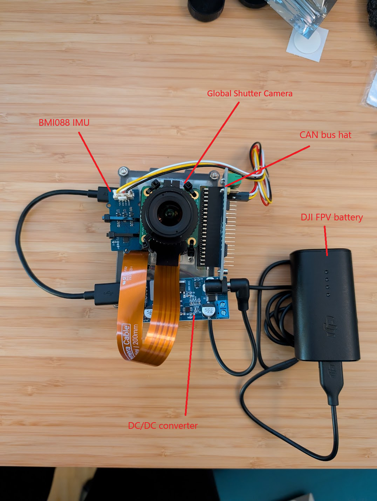

# VINS-Fusion-No-GPS

This is a fork of https://github.com/zinuok/VINS-Fusion-ROS2.

Concept: Feed camera and IMU data to VINS-Fusion running on Raspberry Pi, interpolate GPS coordinates and send "fake" GPS coordinates using Drone-CAN.

VINS-Fusion is the best mono camera algorithm according to the [KITTI Visual Odometry / SLAM Evaluation](https://www.cvlibs.net/datasets/kitti/eval_odometry.php) and it's designed specifically for usage in drones.

The IMU helps in situations where the camera tracking is lost, i.e. during quick movements.

Hardware required:
- [Raspberry Pi Global Shutter camera](https://www.raspberrypi.com/products/raspberry-pi-global-shutter-camera/) with [2.1 mm lens](https://www.amazon.de/dp/B0CVVWSPZF)
- [BMI088 IMU board](https://wiki.seeedstudio.com/Grove-6-Axis_Accelerometer)
- [RS485 CAN HAT](https://www.berrybase.de/rs485-can-hat-fuer-raspberry-pi)
- [9-36V -> 5V / 5A DC/DC converter for battery power supply](https://www.berrybase.de/netzteilmodul-9-36v-5v-5a-mit-usb-ausgang-und-schraubklemmen)
- Optional: Fuse magnetometer and barometer data.

Before you ask: no, it's not finished yet.




## Setup

Install docker on the RPI:

```bash
sudo apt-get update
sudo apt-get install ca-certificates curl gnupg
sudo install -m 0755 -d /etc/apt/keyrings
curl -fsSL https://download.docker.com/linux/debian/gpg | sudo gpg --dearmor -o /etc/apt/keyrings/docker.gpg
sudo chmod a+r /etc/apt/keyrings/docker.gpg

# Add the repository to Apt sources:
echo \
  "deb [arch="$(dpkg --print-architecture)" signed-by=/etc/apt/keyrings/docker.gpg] https://download.docker.com/linux/debian \
  "$(. /etc/os-release && echo "$VERSION_CODENAME")" stable" | \
  sudo tee /etc/apt/sources.list.d/docker.list > /dev/null
sudo apt-get update
sudo apt-get install -y docker-ce docker-ce-cli containerd.io docker-buildx-plugin docker-compose-plugin
```

Then build the docker container for this repo:

```bash
cd docker
make build
```

For running on a Jetson board that has CUDA support open `feature_tracker.h` and uncomment

```bash
#define GPU_MODE 1
```

## Build and run with loop fusion

```bash
docker run \
  -it \
  --rm \
  --net=host \
  -v /tmp/.X11-unix:/tmp/.X11-unix \
  -v /dev:/dev \
  -e DISPLAY=:0 \
  --privileged \
  -v $HOME/.Xauthority:/home/root/.Xauthority \
  -v $(git rev-parse --show-toplevel)/../..:/root/workspace/ \
  -v $(git rev-parse --show-toplevel)/camera.yaml:/root/.ros/camera_info/camera.yaml \
  --name vins-fusion \
  ros:vins-fusion \
  /bin/bash -c \
  "cd /root/workspace/; \
  source /opt/ros/humble/setup.bash; \
  colcon build --symlink-install --cmake-args -DCMAKE_BUILD_TYPE=Release; \
  source ./install/setup.bash; \
  export GSCAM_CONFIG="libcamerasrc ! queue ! video/x-raw,format=NV12 ! videoconvert ! autovideoconvert"; \
  ros2 run gscam gscam_node; \
  ros2 run loop_fusion loop_fusion_node ${CONFIG_IN_DOCKER} & \
  ros2 run vins ros_node_test ${CONFIG_IN_DOCKER}"

ros2 launch vins vins_rviz.launch.xml &
ros2 run vins vins_node ./config/euroc/euroc_mono_imu_config.yaml &
ros2 run loop_fusion loop_fusion_node ./config/euroc/euroc_mono_imu_config.yaml &

# Use the "world" frame in rviz
```

## Camera setup

On the RPI 5 the Global Shutter camera hardware is no longer exposed as a "classic" V4L2 device. Instead, it is driven through the libcamera stack.
Verify that the camera is working using gstreamer:

```bash
gst-launch-1.0 libcamerasrc ! queue ! video/x-raw,format=NV12 ! videoconvert ! autovideosink
```

TODO: camera calibration

## play bag recorded at ROS1
Unfortunately, you can't just play back the bag file recorded at ROS1. 
This is because the filesystem structure for bag file has been changed significantly.
The bag file at ROS2 needs the folder with some meta data for each bag file, which is done using following commands.
- you have to install [this pkg](https://gitlab.com/ternaris/rosbags)
```bash
sudo apt install pipx
pipx install rosbags
```

- run
```bash
export PATH=$PATH:~/.local/bin
rosbags-convert --src foo.bag --dst /path/to/bar
```


## Original Readme:

## 8. Acknowledgements
We use [ceres solver](http://ceres-solver.org/) for non-linear optimization and [DBoW2](https://github.com/dorian3d/DBoW2) for loop detection, a generic [camera model](https://github.com/hengli/camodocal) and [GeographicLib](https://geographiclib.sourceforge.io/).

## 9. License
The source code is released under [GPLv3](http://www.gnu.org/licenses/) license.

We are still working on improving the code reliability. For any technical issues, please contact Tong Qin <qintonguavATgmail.com>.

For commercial inquiries, please contact Shaojie Shen <eeshaojieATust.hk>.
